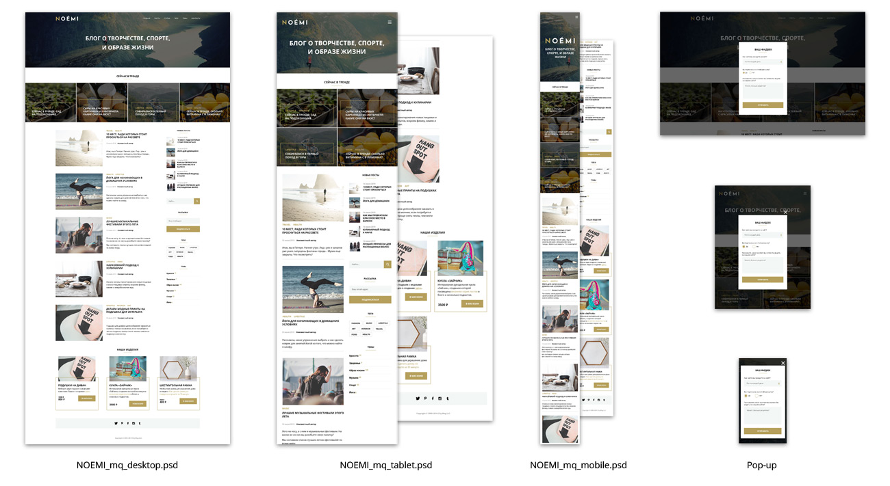

# Главная страница блога

## 🛠️ Стек:
HTML, CSS

## 📝 Реализовано:
- кроссбраузерность;
- адаптивность к размерам экранов,переполнению контента, отсутствию изображений;
- pixel perfect;
- семантичность тегов и названий атрибутов;
- валидность по W3C.

